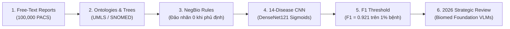

# 👩‍💼 KỊCH BẢN THUYẾT TRÌNH & DEMO CHI TIẾT: DUNG
## 🏷️ Chủ đề: Automated Label Extraction, 14-Disease CNN Vision Models & 2026 Review
> **Thời lượng chuẩn:** 5 phút (khoảng 50 giây – 1 phút / bước)  
> **Nền tảng Demo:** Mở tab **👩‍💼 Dung** trên ứng dụng [`treatment_effect_demo.html`](index.html)

---

---

## 📍 BƯỚC 1, 2, 3: KHAI PHÁ BÁO CÁO TỰ ĐỘNG, ONTOLOGY & NEGBIO
* **Thời lượng:** ~1 phút 30 giây
* **Thao tác trên màn hình:**
  1. Bấm vào bước **`1. Free-Text Reports`** &rarr; Chọn **`Sample 1 (Negation)`** và **`Sample 3 (Synonym)`**.
  2. Bấm vào bước **`2. Synonyms & 'Is-A' Trees`** &rarr; Bấm chọn thuật ngữ **`"airspace consolidation"`** (Chỉ vào cây phân cấp Ontology).
  3. Bấm vào bước **`3. Negation Detection Rules`** &rarr; Bấm chọn **`"No evidence of..."`** (Chỉ vào Cây cú pháp NegBio đảo nhãn thành 0).

### 🇬🇧 English Spoken Script:
> *"Thank you Linh. Good morning Professor and everyone, my name is Dung.*
> 
> *To train deep vision models on hospital PACS archives, we face a massive bottleneck: Hospitals have over 100,000 unlabelled X-ray images! Board-certified radiologists do not have time to manually annotate 100,000 scans. However, free-text diagnostic summaries already exist for every scan.*
> 
> *Our automated NLP pipeline converts raw text into structured binary training labels:*
> 1. *In Step 1 and 2, radiologists use varied medical jargon. Using **Medical Ontologies (UMLS & SNOMED CT)**, our system maps synonyms like 'airspace consolidation' and hierarchical 'is-a' relationships like 'bronchopneumonia' directly to the master **Pneumonia** category.*
> 2. *In Step 3, crucially, mentioning a disease does NOT mean the patient has it! Look at Sample 1: 'No evidence of pneumonia'. Standard keyword matching would wrongly assign label 1. Our **NegBio parser** analyzes syntactic dependency trees: Finding a negation trigger within a 3-token window flips the presence label to **0 (Absent)**, preventing thousands of false positive training targets."*

### 🇻🇳 Lời Thoại Tiếng Việt:
> *"Cảm ơn Linh. Kính chào Thầy và các bạn, mình là Dung.*
> 
> *Để huấn luyện mô hình thị giác trên kho dữ liệu PACS của bệnh viện, chúng ta gặp một nút thắt cổ chai khổng lồ: Bệnh viện có hơn 100,000 ảnh X-quang nhưng hoàn toàn chưa được gắn nhãn! Các bác sĩ đầu ngành không thể ngồi dán nhãn thủ công từng bức ảnh. Tuy nhiên, mọi ca chụp đều có sẵn một bản báo cáo kết luận văn bản tự do.*
> 
> *Quy trình NLP tự động của nhóm biến văn bản thô thành các nhãn nhị phân chuẩn xác:*
> 1. *Ở Bước 1 và 2, bác sĩ thường dùng các từ ngữ lâm sàng rất phong phú. Sử dụng **Cây phả hệ Thuật ngữ Y khoa (UMLS & SNOMED CT)**, hệ thống tự động gom các từ đồng nghĩa như 'đông đặc phế nang' và quan hệ cha-con như 'viêm phế quản phổi' về đúng nhãn mẹ **Viêm phổi (Pneumonia)**.*
> 2. *Ở Bước 3, điều tối quan trọng: Việc bác sĩ nhắc tên bệnh không đồng nghĩa với bệnh nhân mắc bệnh đó! Nhìn vào Mẫu số 1: 'Không thấy dấu hiệu của viêm phổi'. Nếu chỉ tìm từ khóa đơn giản sẽ gán nhầm nhãn 1 (Dương tính). Bộ phân tích **NegBio** duyệt cây cú pháp: Khi phát hiện từ phủ định đứng trước, nó lập tức đảo nhãn về **0 (Không mắc bệnh)**, loại bỏ hàng ngàn ca báo động giả."*

* **📐 Điểm Toán & ML Cần Nhấn Mạnh:**
  - $\text{Label}(c) = \mathbb{I}(\text{Mentioned}(c)) \times (1 - \text{Negated}(c))$.
  - Ánh xạ Ontology: $\text{Synonym}(w) \mapsto c$ và $\text{Child}(w) \subseteq \text{Parent}(c)$.

---

## 📍 BƯỚC 4: HUẤN LUYỆN MẠNG CNN 14 BỆNH (DENSENET121)
* **Thời lượng:** ~1 phút 15 giây
* **Thao tác trên màn hình:**
  1. Bấm vào bước **`4. 14-Disease CNN Training`** trên thanh Pipeline.
  2. Bấm chuyển giữa **`Scan #0599 (Pneumonia)`** và **`Scan #1204 (Cardiomegaly)`**.
  3. Chỉ vào 4 thanh xác suất Sigmoid (Pneumonia: 88%, Infiltration: 72%, Cardiomegaly: 14%).
  4. Đọc công thức **Weighted Cross-Entropy Loss** trên Thẻ Toán học.

### 🇬🇧 English Spoken Script:
> *"In Step 4, we link our extracted labels directly into Computer Vision training.*
> 
> *These binary vectors serve as ground-truth targets to train a **DenseNet121 Multi-Label CNN Classifier**. Because a patient can have both Pneumonia and Infiltration simultaneously, we use **14 independent Sigmoid heads** $\sigma(z_c)$ rather than Softmax.*
> 
> *Look at Scan #0599: Our CNN accurately outputs an 88% probability for Pneumonia and 72% for Infiltration, while keeping unrelated Cardiomegaly low at 14%.*
> 
> *To combat extreme class imbalance (where healthy scans vastly outnumber rare pathologies), we train the network using **Weighted Cross-Entropy Loss**, penalizing missed positive disease cases with a higher loss weight $w_{p,c}$."*

### 🇻🇳 Lời Thoại Tiếng Việt:
> *"Ở Bước 4, chúng ta kết nối các nhãn vừa trích xuất trực tiếp vào bài toán Thị giác máy tính.*
> 
> *Các vector nhãn nhị phân này trở thành dữ liệu chuẩn (Ground Truth) để huấn luyện mạng **CNN DenseNet121 Phân loại Đa nhãn**. Vì một bệnh nhân có thể vừa bị Viêm phổi vừa bị Thâm nhiễm cùng lúc, ta sử dụng **14 đầu ra Sigmoid độc lập** $\sigma(z_c)$ thay vì dùng Softmax.*
> 
> *Thầy và các bạn hãy nhìn vào ca chụp #0599: Mạng CNN dự đoán chính xác 88% Viêm phổi và 72% Thâm nhiễm, trong khi bóng tim to chỉ có 14%.*
> 
> *Để giải quyết tình trạng mất cân bằng dữ liệu nghiêm trọng (ảnh bình thường nhiều gấp hàng trăm lần ảnh có bệnh hiếm), nhóm áp dụng hàm mất mát **Weighted Cross-Entropy Loss**, gán trọng số phạt $w_{p,c}$ rất nặng nếu mô hình bỏ sót bệnh nhân mắc bệnh."*

* **📐 Điểm Toán & ML Cần Nhấn Mạnh:**
  - Xác suất đầu ra độc lập: $\hat{y}_c = \sigma(z_c) = \frac{1}{1 + e^{-z_c}}$.
  - Hàm mất mát có trọng số: $\mathcal{L}_{\text{CNN}} = -\sum_{c=1}^{14} \left[ w_{p,c} y_c \log \hat{y}_c + w_{n,c} (1-y_c) \log(1-\hat{y}_c) \right]$.

---

## 📍 BƯỚC 5: MÔ PHỎNG NGƯỠNG RA QUYẾT ĐỊNH & ĐIỂM F1-SCORE
* **Thời lượng:** ~1 phút 15 giây
* **Thao tác trên màn hình:**
  1. Bấm vào bước **`5. CNN F1 Threshold Simulator`** trên thanh Pipeline.
  2. Kéo thanh trượt **Threshold** từ `0.10` lên `0.50` rồi lên `0.85`.
  3. Chỉ vào sự biến thiên của Precision, Recall và điểm **F1-Score (0.921)**.
  4. Chỉ vào Bảng Ma trận Nhầm lẫn (Confusion Matrix: 9 TP, 1 FN, 1 FP).

### 🇬🇧 English Spoken Script:
> *"In Step 5, how do we evaluate medical vision models on rare diseases where prevalence is only 1%?*
> 
> *If a hospital tests 1,000 scans and 990 are healthy, a naive dummy model that predicts 'Negative' for all 1,000 scans achieves a deceptive **99.0% Accuracy**! But it misses all 10 sick patients, leading to fatal clinical failure.*
> 
> *Therefore, Accuracy is completely useless in clinical medicine. We must evaluate using the harmonic **F1-Score**.*
> 
> *Watch our live threshold simulator: Moving the decision threshold allows the medical team to fine-tune the trade-off between Precision and Recall. Setting the threshold to **0.50** achieves an optimal balanced F1-Score of **0.921**, successfully diagnosing 9 out of 10 true positive cases."*

### 🇻🇳 Lời Thoại Tiếng Việt:
> *"Ở Bước 5, làm sao để đánh giá mô hình thị giác y khoa trên các bệnh lý hiếm gặp chỉ chiếm 1% dân số?*
> 
> *Nếu bệnh viện có 1,000 ca chụp trong đó 990 ca bình thường, một mô hình lười biếng luôn đoán 'Không có bệnh' cho cả 1,000 ca sẽ đạt **Độ chính xác (Accuracy) lên tới 99.0%**! Nhưng nó bỏ sót toàn bộ 10 người đang nguy kịch, gây hậu quả chết người trong y tế.*
> 
> *Do đó, chỉ số Accuracy hoàn toàn vô nghĩa trong y khoa. Chúng ta bắt buộc phải đánh giá bằng điểm **F1-Score** (Trung bình điều hòa giữa Precision và Recall).*
> 
> *Nhìn vào bộ mô phỏng ngưỡng trực quan trên màn hình: Khi ta điều chỉnh ngưỡng quyết định, bác sĩ có thể chủ động cân bằng giữa độ chuẩn xác và độ nhạy. Tại ngưỡng **0.50**, mô hình đạt điểm F1 tối ưu là **0.921**, cứu sống 9 trên 10 bệnh nhân mắc bệnh thực sự."*

* **📐 Điểm Toán & ML Cần Nhấn Mạnh:**
  - $\text{Precision} = \frac{\text{TP}}{\text{TP} + \text{FP}}$, $\text{Recall} = \frac{\text{TP}}{\text{TP} + \text{FN}}$.
  - $\text{F1} = 2 \times \frac{\text{Precision} \times \text{Recall}}{\text{Precision} + \text{Recall}} = \mathbf{0.921}$.

---

## 📍 BƯỚC 6: ĐÁNH GIÁ CHIẾN LƯỢC 2026 & KẾT LUẬN TOÀN NHÓM
* **Thời lượng:** ~1 phút 00 giây
* **Thao tác trên màn hình:**
  1. Bấm vào bước **`6. 2026 Strategic Review`** trên thanh Pipeline.
  2. Bấm nút **`Biomed Foundation VLM (2026)`** &rarr; Chỉ vào bảng so sánh công nghệ.
  3. Kết thúc bài thuyết trình và kính mời Thầy cùng các bạn đặt câu hỏi.

### 🇬🇧 English Spoken Script:
> *"Finally in Step 6, we provide our group's 2026 strategic critique of Course 3.*
> 
> *While Course 3 lays the rigorous theoretical bedrock for Causal Inference and Medical NLP, technology has leapt forward. In 2026, building brittle regex rule engines to generate labels is being superseded by **Biomedical Vision-Language Foundation Models** such as BiomedCLIP and LLaVA-Med. These models perform end-to-end zero-shot visual question answering and diagnostic report generation directly.*
> 
> *To summarize our group's pipeline:*
> - *Khương proved why RCT eliminates confounding.*
> - *Hiếu modeled individual CATE with T-Learners and SHAP.*
> - *Linh tokenized text for BERT and localized pathologies with Grad-CAM.*
> - *And I mined 100,000 reports to train 14-disease CNNs with optimal F1 thresholds.*
> 
> *Thank you very much, Professor and classmates, for your attention. Our group is now ready for Q&A!"*

### 🇻🇳 Lời Thoại Tiếng Việt:
> *"Cuối cùng ở Bước 6, nhóm xin đưa ra góc nhìn đánh giá chiến lược năm 2026 đối với nội dung Course 3.*
> 
> *Mặc dù Course 3 trang bị tư duy nhân quả và nền tảng xử lý dữ liệu y khoa cực kỳ mẫu mực, công nghệ AI đang tiến rất nhanh. Đến năm 2026, việc xây dựng các luật Regex thủ công để gán nhãn đang dần được thay thế bởi **Mô hình Nền tảng Thị giác-Ngôn ngữ Y sinh (Biomedical Foundation VLMs)** như BiomedCLIP hay LLaVA-Med, cho phép hỏi đáp và sinh kết luận bệnh án Zero-shot trực tiếp từ ảnh chụp.*
> 
> *Tóm tắt lại toàn bộ luồng quy trình của nhóm:*
> - *Bạn Khương chứng minh tại sao RCT loại bỏ hoàn toàn yếu tố gây nhiễu.*
> - *Bạn Hiếu mô hình hóa lợi ích cá nhân CATE bằng T-Learner và bóc tách bằng SHAP.*
> - *Bạn Linh mã hóa Tensor cho BERT và định vị tổn thương X-quang bằng Grad-CAM.*
> - *Và mình khai phá 100,000 báo cáo để huấn luyện mạng CNN 14 bệnh với điểm F1 tối ưu.*
> 
> *Nhóm mình xin trân trọng cảm ơn Thầy và các bạn đã chú ý lắng nghe. Nhóm rất sẵn sàng đón nhận các câu hỏi phản biện!"*

---

## 🎯 CÂU HỎI GIẢNG VIÊN DỰ KIẾN CHO DUNG (Q&A PREP)

1. **❓ Câu hỏi:** *"Tại sao lại dùng 14 hàm Sigmoid độc lập ở lớp cuối DenseNet121 mà không dùng hàm Softmax?"*
   - **💡 Trả lời:** *"Hàm Softmax giả định các lớp loại trừ lẫn nhau (mutually exclusive), tức là tổng 14 xác suất phải bằng 100% (bệnh nhân chỉ được mắc đúng 1 bệnh). Trong ảnh X-quang ngực thực tế, một bệnh nhân có thể đồng thời mắc cả Viêm phổi, Tràn dịch màng phổi và Thâm nhiễm (bài toán Multi-label Classification). Do đó, ta phải dùng 14 hàm Sigmoid độc lập để mỗi bệnh có một ngưỡng xác suất riêng từ 0% đến 100%."*

2. **❓ Câu hỏi:** *"Làm sao NegBio xử lý được các câu phủ định phức tạp có nhiều mệnh đề liên từ?"*
   - **💡 Trả lời:** *"NegBio không dựa vào khoảng cách từ đơn thuần (string distance) mà dựa trên Cây phân tích cú pháp phụ thuộc (Dependency Parse Tree). Nó tìm kiếm đường đi cú pháp (dependency path) ngắn nhất giữa từ kích hoạt phủ định (như 'no', 'free of') và thực thể bệnh ('pneumonia'). Nếu giữa chúng có liên từ ngắt mệnh đề (như 'but', 'however'), đường đi bị chặn và NegBio sẽ không phủ định nhầm mệnh đề phía sau."*
