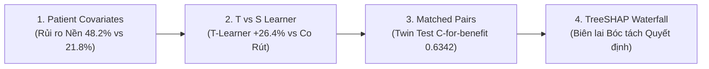

# 👨‍💻 KỊCH BẢN THUYẾT TRÌNH & DEMO CHI TIẾT: HIẾU
## 🌲 Chủ đề: Treatment Effect Modeling (CATE), T-Learner vs S-Learner, Matched Pairs & SHAP
> **Thời lượng chuẩn:** 5 phút (khoảng 1.25 phút / bước)  
> **Nền tảng Demo:** Mở tab **👨‍💻 Hiếu** trên ứng dụng [`treatment_effect_demo.html`](index.html)

---

---

## 📍 BƯỚC 1: ĐẶC TRƯNG BỆNH NHÂN & MÔ HÌNH NGUY CƠ NỀN
* **Thời lượng:** ~1 phút 15 giây
* **Thao tác trên màn hình:**
  1. Bấm vào bước **`1. Patient Covariates & Baseline Risk`** trên thanh Pipeline.
  2. Bấm chọn nút **`👴 Grandpa An (High SBP 165)`** &rarr; Chỉ vào 3 thanh trượt Tuổi (70), Huyết áp (165), BMI (31.0).
  3. Chỉ vào Khối 6 **Baseline Risk Radar**: Nguy cơ chưa điều trị ($48.2\%$) vs Nguy cơ sau điều trị ($21.8\%$).
  4. Bấm thử nút **`🏃 Alex (Normal SBP 118)`** để so sánh sự khác biệt.

### 🇬🇧 English Spoken Script:
> *"Thank you Khương. Hello Professor and colleagues, I am Hiếu.*
> 
> *In Step 1, we start from patient covariates $X$, which include Age, Systolic Blood Pressure (SBP), and BMI. We model baseline risk without treatment using a logistic sigmoid link function $\sigma(\beta^T X)$.*
> 
> *Look at Grandpa An: At age 70 with an SBP of 165 mmHg, his baseline stroke risk without medication is **48.2%**. If treated, his risk drops to **21.8%**. Because his baseline risk is extremely high, he has the greatest room for absolute risk reduction—yielding a net individual benefit of **+26.4%**!*
> 
> *In contrast, when we switch to Alex—who is 35 with normal blood pressure 118—his untreated risk is already low (8.5%). Even with the drug, he only gains +5.2% benefit. Our system intelligently flags this: Strongly prescribe for Grandpa An, but suggest lifestyle and diet modification for Alex."*

### 🇻🇳 Lời Thoại Tiếng Việt:
> *"Cảm ơn Khương. Kính chào Thầy và các bạn, mình là Hiếu.*
> 
> *Ở Bước 1, ta bắt đầu từ các đặc trưng bệnh nhân $X$ gồm Tuổi, Huyết áp tâm thu (SBP) và chỉ số khối cơ thể (BMI). Ta tính toán nguy cơ nền khi chưa có thuốc bằng hàm Logistic $\sigma(\beta^T X)$.*
> 
> *Thầy và các bạn hãy nhìn vào trường hợp Ông An: Ở tuổi 70 với huyết áp 165 mmHg, nguy cơ đột quỵ tự nhiên khi không uống thuốc của ông là **48.2%**. Nếu uống thuốc, nguy cơ giảm mạnh xuống **21.8%**. Vì nguy cơ ban đầu rất cao nên biên độ giảm nguy cơ tuyệt đối của ông đạt mức tối đa — mang lại lợi ích cá thể hóa lên tới **+26.4%**!*
> 
> *Ngược lại, khi chuyển sang anh Alex — 35 tuổi với huyết áp chuẩn 118 — rủi ro ban đầu của anh chỉ có 8.5%, uống thuốc chỉ giảm thêm được +5.2%. Hệ thống tự động nhận diện và đưa ra khuyến cáo: Kê đơn khẩn cấp cho Ông An, nhưng khuyên Alex điều chỉnh chế độ ăn uống trước."*

* **📐 Điểm Toán & ML Cần Nhấn Mạnh:**
  - Nguy cơ nền kiểm soát: $\hat{\mu}_0(x) = P(Y(0)=1 \mid X=x) = \sigma(\beta_0 + \beta_1 \text{Age} + \beta_2 \text{SBP} + \beta_3 \text{BMI})$.
  - Quy tắc lâm sàng: Bệnh nhân có nguy cơ nền càng cao thường có mức giảm nguy cơ tuyệt đối (ARR) càng lớn.

---

## 📍 BƯỚC 2: T-LEARNER VS S-LEARNER (HIỆN TƯỢNG CO RÚT HỆ SỐ)
* **Thời lượng:** ~1 phút 15 giây
* **Thao tác trên màn hình:**
  1. Bấm vào bước **`2. T-Learner vs S-Learner (Shrinkage)`** trên thanh Pipeline.
  2. Bấm nút **`🌲🌲 T-Learner`** &rarr; Chỉ vào kết quả **+26.4% Benefit**.
  3. Bấm nút **`🌲 S-Learner (Shrinkage)`** &rarr; Chỉ vào kết quả sụt giảm **+15.2% (Underestimated!)**.
  4. Chỉ vào Sơ đồ kiến trúc Khối 6 giải thích nguyên nhân cây quyết định bỏ quên biến $W$.

### 🇬🇧 English Spoken Script:
> *"In Step 2, how do we architect Machine Learning to estimate individual treatment effect (CATE)? We compare two fundamental meta-learners:*
> 
> *1. **T-Learner (Two-Tree Method):** We train TWO separate models—$\hat{\mu}_1(x)$ exclusively on the treated cohort, and $\hat{\mu}_0(x)$ on the control cohort. As shown on screen, subtracting the two models ($\hat{\mu}_0 - \hat{\mu}_1$) preserves full feature interactions and predicts the true **+26.4%** benefit.*
> 
> *2. **S-Learner (Single-Tree Hazard):** In contrast, S-Learner fits ONE single tree $\hat{\mu}(X, W)$ using treatment indicator $W$ as one of the features. Because continuous features like Age and Blood Pressure have much larger sample variance, standard decision tree split criteria (such as Gini impurity or MSE) repeatedly split on Age and Blood Pressure, completely ignoring $W$!*
> 
> *This leads to severe **Feature Shrinkage**, forcing the estimated CATE to collapse toward zero (underestimating benefit down to **+15.2%**). Therefore, T-Learner is vastly superior when treatment effect heterogeneity is strong."*

### 🇻🇳 Lời Thoại Tiếng Việt:
> *"Ở Bước 2, làm sao để thiết kế mô hình Machine Learning dự đoán hiệu quả cá nhân CATE? Ta so sánh 2 kiến trúc kinh điển của khóa học:*
> 
> *1. **T-Learner (Phương pháp Hai Cây):** Ta huấn luyện HAI mô hình hoàn toàn riêng biệt — $\hat{\mu}_1(x)$ cho nhóm uống thuốc và $\hat{\mu}_0(x)$ cho nhóm đối chứng (như 2 bác sĩ chuyên trách). Hiệu số giữa 2 mô hình ($\hat{\mu}_0 - \hat{\mu}_1$) giữ trọn các mối tương tác phức tạp và dự đoán chính xác mức lợi ích **+26.4%**.*
> 
> *2. **S-Learner (Hiểm họa Một Cây):** Ngược lại, S-Learner gộp chung vào MỘT cây quyết định duy nhất $\hat{\mu}(X, W)$ với biến can thiệp $W$ chỉ là một cột đặc trưng. Do Tuổi và Huyết áp có phương sai lớn hơn rất nhiều, thuật toán chia nhánh của Decision Tree luôn ưu tiên chia theo Tuổi và Huyết áp mà hầu như không bao giờ chia nhánh theo $W$!*
> 
> *Hậu quả là xảy ra hiện tượng **Co rút đặc trưng (Feature Shrinkage)**, ép hiệu quả điều trị dự đoán bị kéo về 0 và đánh giá thấp lợi ích chỉ còn **+15.2%**! Vì vậy, T-Learner luôn là lựa chọn vượt trội khi hiệu quả điều trị có tính phân hóa mạnh."*

* **📐 Điểm Toán & ML Cần Nhấn Mạnh:**
  - $\text{CATE}_T(x) = \hat{\mu}_0(x) - \hat{\mu}_1(x)$.
  - $\text{CATE}_S(x) = \hat{\mu}(x, 0) - \hat{\mu}(x, 1) \approx 0$ (bị co rút do cây không split trên $W$).

---

## 📍 BƯỚC 3: ĐÁNH GIÁ BẰNG CẶP TƯƠNG ĐỒNG (TWIN MATCHING & C-FOR-BENEFIT)
* **Thời lượng:** ~1 phút 15 giây
* **Thao tác trên màn hình:**
  1. Bấm vào bước **`3. Matched Pairs & C-for-benefit`** trên thanh Pipeline.
  2. Bấm nút **`🎲 Resample Clinical Twin Pairs`** &rarr; Quan sát bảng 4 cặp bệnh nhân đổi trạng thái.
  3. Chỉ vào Thước đo chuẩn bệnh viện Khối 6: **C-for-benefit = 0.6342**.

### 🇬🇧 English Spoken Script:
> *"In Step 3, we solve a critical evaluation puzzle: Since we never observe ground-truth counterfactuals for any individual, standard metrics like MSE or Accuracy are completely unusable! How can we validate our CATE model?*
> 
> *We implement the **Matched Pairs Twin Test** (van Klaveren et al., 2018). In our validation cohort, we match each treated patient with a clinically identical control patient who shares the exact same Age, SBP, and BMI. For each matched pair, we compute the observed binary difference $y_d = Y_{\text{ctrl}} - Y_{\text{trt}}$, which equals $+1$ if the treated twin survived while the control twin suffered a stroke.*
> 
> *We then evaluate our model using the **C-for-benefit** metric (Concordance for benefit). Our model achieves a validation score of **0.6342**! In causal treatment estimation, random guessing is 0.50, and 0.60 to 0.65 is the recognized international benchmark for hospital-grade ranking accuracy."*

### 🇻🇳 Lời Thoại Tiếng Việt:
> *"Ở Bước 3, chúng ta giải quyết bài toán hóc búa nhất khi kiểm thử: Vì không bao giờ thấy được kết cục song song của cùng 1 người, các chỉ số thông thường như MSE hay Accuracy hoàn toàn vô dụng! Vậy làm sao kiểm chứng mô hình CATE có chính xác không?*
> 
> *Nhóm áp dụng phương pháp **Ghép cặp Tương đồng (Matched Pairs Twin Test)**. Trong tập kiểm định, ta tìm 2 bệnh nhân có chỉ số lâm sàng giống hệt nhau (như hai anh em sinh đôi: cùng tuổi, cùng huyết áp, cùng BMI), trong đó 1 người được uống thuốc còn người kia uống giả dược. Ta tính hiệu số quan sát được $y_d = Y_{\text{ctrl}} - Y_{\text{trt}}$: Bằng $+1$ nếu người uống thuốc sống sót còn người uống giả dược bị đột quỵ.*
> 
> *Sau đó, ta tính chỉ số **C-for-benefit** (đo lường mức độ đồng thuận thứ tự xếp hạng). Mô hình của nhóm đạt điểm số thực nghiệm là **0.6342**! Trong Causal ML, đoán mò là 0.50, và khoảng 0.60 đến 0.65 là chuẩn mực vàng quốc tế chứng minh mô hình xếp hạng ưu tiên bệnh nhân cực kỳ chính xác."*

* **📐 Điểm Toán & ML Cần Nhấn Mạnh:**
  - $y_d = Y_{\text{ctrl}} - Y_{\text{trt}} \in \{-1 \text{ (Hại)}, 0 \text{ (Hòa)}, +1 \text{ (Lợi)}\}$.
  - $\text{C-for-benefit} = \frac{\text{Concordant Pairs} + 0.5 \times \text{Ties}}{\text{Permissible Pairs}} = \mathbf{0.6342}$.

---

## 📍 BƯỚC 4: BIÊN LAI BÓC TÁCH QUYẾT ĐỊNH TREE-SHAP (LOCAL SHAP RECEIPT)
* **Thời lượng:** ~1 phút 15 giây
* **Thao tác trên màn hình:**
  1. Bấm vào bước **`4. Local SHAP Waterfall Receipt`** trên thanh Pipeline.
  2. Kéo nhẹ thanh trượt **SBP Perturbation** từ 165 lên 180 mmHg để thấy đóng góp của Huyết áp tăng lên.
  3. Đọc từng dòng của "Hóa đơn biên lai quyết định SHAP".
  4. Chuyển giao bài thuyết trình sang Linh.

### 🇬🇧 English Spoken Script:
> *"Finally in Step 4, doctors rightfully reject black-box AI. If our algorithm tells a cardiologist to prescribe a high-potency drug, it must explain WHY.*
> 
> *We integrate **TreeSHAP** based on Nobel-prize winning Shapley Values. Thanks to the Shapley Efficiency theorem, the local feature attributions sum up perfectly to the patient's individual CATE:*
> - *Base population benefit: **+14.0%***
> - *High SBP (165 mmHg) adds: **+8.5% push***
> - *Elderly Age (70 yrs) adds: **+3.4% push***
> - *Obesity BMI (31.0) adds: **+0.5% push***
> - *👉 **Total Personalized Benefit: +26.4%***
> 
> *This produces a clean, transparent **Itemized Decision Receipt** for the electronic health record. Next, **Linh** will show how we process unstructured clinical text notes and chest X-ray scans!"*

### 🇻🇳 Lời Thoại Tiếng Việt:
> *"Cuối cùng ở Bước 4, bác sĩ hoàn toàn có lý khi từ chối tin tưởng các mô hình 'hộp đen' khó hiểu. Khi AI đề xuất kê đơn một loại thuốc mạnh, nó bắt buộc phải giải thích TẠI SAO.*
> 
> *Nhóm tích hợp thuật toán **TreeSHAP** dựa trên lý thuyết Giá trị Shapley (đoạt giải Nobel). Nhờ định lý cộng tính (Shapley Additivity), tổng các đóng góp biên giải thích trọn vẹn 100% con số CATE của bệnh nhân:*
> - *Lợi ích nền dân số: **+14.0%***
> - *Huyết áp tâm thu cao (165 mmHg) đóng góp thêm: **+8.5%***
> - *Độ tuổi cao (70 tuổi) đóng góp thêm: **+3.4%***
> - *Thừa cân BMI (31.0) đóng góp thêm: **+0.5%***
> - *👉 **Tổng Lợi Ích Cá Thể Hóa: +26.4%***
> 
> *Điều này tạo ra một 'Hóa đơn giải trình quyết định' minh bạch gắn thẳng vào bệnh án điện tử. Tiếp theo, xin mời bạn **Linh** trình bày về kỹ thuật xử lý văn bản bệnh án và ảnh X-quang phổi!"*

---

## 🎯 CÂU HỎI GIẢNG VIÊN DỰ KIẾN CHO HIẾU (Q&A PREP)

1. **❓ Câu hỏi:** *"Tại sao C-for-benefit chỉ đạt 0.6342, nghe có vẻ thấp hơn C-index thông thường (0.77 - 0.80)?"*
   - **💡 Trả lời:** *"C-index thông thường đo nguy cơ tuyệt đối $Y$, chỉ cần phân biệt người sống vs người chết. C-for-benefit đo hiệu ứng chênh lệch giữa hai kết cục song song $Y(0) - Y(1)$, vốn bị nhiễu gấp đôi do phải ghép cặp 2 cá nhân khác nhau. Trong bài báo nền tảng của van Klaveren (2018), mô hình lâm sàng tốt nhất cũng chỉ đạt 0.60–0.65. Con số 0.6342 là mức độ phân loại rất chuẩn mực trong y tế."*

2. **❓ Câu hỏi:** *"X-Learner khác gì T-Learner và khi nào nên dùng X-Learner?"*
   - **💡 Trả lời:** *"T-Learner dùng tốt khi 2 nhóm điều trị và đối chứng có kích thước tương đương nhau. Khi dữ liệu mất cân bằng nặng (ví dụ nhóm dùng thuốc chỉ chiếm 5%, nhóm đối chứng 95%), mô hình $\hat{\mu}_1$ sẽ thiếu dữ liệu. X-Learner giải quyết bằng cách ước lượng Imputed Counterfactuals theo 2 giai đoạn chéo nhau, tối ưu khi dữ liệu mất cân bằng."*
