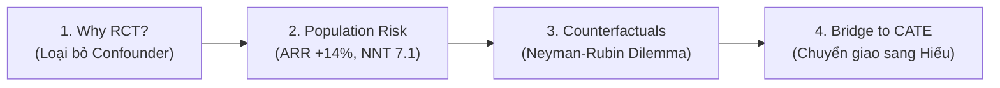

# 👨‍💼 KỊCH BẢN THUYẾT TRÌNH & DEMO CHI TIẾT: KHƯƠNG
## 🏥 Chủ đề: Clinical Foundations, RCT Trials & Causal Inference
> **Thời lượng chuẩn:** 5 phút (khoảng 1.25 phút / bước)  
> **Nền tảng Demo:** Mở tab **👨‍💼 Khương** trên ứng dụng [`treatment_effect_demo.html`](index.html)

---

---

## 📍 BƯỚC 1: TẠI SAO PHẢI THỬ NGHIỆM NGẪU NHIÊN (WHY RCT?)
* **Thời lượng:** ~1 phút 15 giây
* **Thao tác trên màn hình:**
  1. Bấm vào bước **`1. Clinical Question (Why RCT?)`** trên thanh Pipeline.
  2. Bấm nút **`🎲 Coin Flip (Clean RCT)`** &rarr; Chỉ vào Bảng **Table 1** (SMD < 0.1).
  3. Bấm thử nút **`👨‍⚕️ Doctor Choice (Biased)`** &rarr; Kéo nhẹ thanh trượt Bias &rarr; Chỉ vào thông báo lỗi màu đỏ trên Sơ đồ DAG.
  4. Bấm lại nút **`🎲 Coin Flip (Clean RCT)`** để trở về trạng thái chuẩn.

### 🇬🇧 English Spoken Script:
> *"Good morning Professor and everyone. My name is Khương. Today, our group presents 'AI for Medical Treatment'.*
> 
> *We begin with the most fundamental clinical question: How do doctors prove a new drug actually saves lives? In real-world hospitals, doctors naturally prescribe stronger medicines to sicker patients. If we train standard Machine Learning on observational records, the algorithm will see that drug recipients die more often, falsely concluding that the drug causes death! This is called **Confounding Bias**.*
> 
> *To eliminate this bias, we conduct a **Randomized Controlled Trial (RCT)**. As you see on the screen, when we use a random coin toss, it completely cuts the backdoor confounding path from patient baseline health to treatment assignment. In our live Table 1, baseline covariates like Age, Blood Pressure, and BMI have a Standardized Mean Difference (SMD) below 0.1, proving mathematically that the treatment and placebo arms are perfectly comparable."*

### 🇻🇳 Lời Thoại Tiếng Việt:
> *"Kính chào Thầy và các bạn, mình là Khương. Hôm nay nhóm mình xin trình bày về chủ đề 'AI trong Điều Trị Y Khoa'.*
> 
> *Chúng ta bắt đầu với câu hỏi lâm sàng cốt lõi nhất: Làm sao chứng minh một loại thuốc mới thực sự cứu sống bệnh nhân? Trong bệnh viện thực tế, bác sĩ luôn có xu hướng kê đơn thuốc nặng cho bệnh nhân trở nặng. Nếu đưa dữ liệu lịch sử này vào mô hình Machine Learning thông thường, mô hình sẽ thấy người uống thuốc tử vong nhiều hơn và kết luận sai lầm rằng thuốc gây tử vong! Đây chính là **Độ lệch do Yếu tố gây nhiễu (Confounding Bias)**.*
> 
> *Để giải quyết triệt để, y học dùng **Thử nghiệm ngẫu nhiên có đối chứng (RCT)**. Như Thầy và các bạn thấy trên màn hình, khi ta bốc thăm ngẫu nhiên (Coin Toss), nhánh gây nhiễu từ tình trạng bệnh sang việc chỉ định thuốc bị cắt đứt hoàn toàn. Nhìn vào Bảng Table 1 thực tế: Các biến nền như Tuổi, Huyết áp và BMI đều có chỉ số sai lệch SMD dưới 0.1, chứng minh hai nhóm hoàn toàn tương đồng về mặt toán học."*

* **📐 Điểm Toán & ML Cần Nhấn Mạnh (Nếu Giám khảo hỏi):**
  - Công thức đồng nhất nhân quả: $P(Y=1 \mid \text{do}(W=1)) = P(Y=1 \mid W=1)$ khi và chỉ khi không có backdoor path.
  - Tiêu chuẩn cân bằng: $|\text{SMD}| < 0.1$ với $\text{SMD} = \frac{\bar{X}_1 - \bar{X}_0}{\sqrt{(s_1^2 + s_0^2)/2}}$.

---

## 📍 BƯỚC 2: ĐO LƯỜNG MỨC GIẢM NGUY CƠ DÂN SỐ (ARR & NNT)
* **Thời lượng:** ~1 phút 15 giây
* **Thao tác trên màn hình:**
  1. Bấm vào bước **`2. Population Risk (ARR & NNT)`** trên thanh Pipeline.
  2. Kéo thanh trượt **Control Event Rate** về `35%` và **Treatment Power (RRR)** về `40%`.
  3. Chỉ tay vào 2 ô số lớn: **ARR (+14.0%)** và **NNT (7.1)**.
  4. Chỉ vào **Lưới 10 Bệnh Nhân** (1 ô xanh lá 🟢, 1 ô đỏ 🔴, các ô trắng ⚪).

### 🇬🇧 English Spoken Script:
> *"Moving to Step 2, how do we express treatment benefit in metrics that clinicians and hospital boards actually trust?*
> 
> *Pharmaceutical marketing often highlights **Relative Risk Reduction (RRR)** because 40% sounds impressive. But in clinical economics, what matters is **Absolute Risk Reduction (ARR)** and **Number Needed to Treat (NNT)**.*
> 
> *Look at our live trial simulation with 1,200 patients: The control event rate is 35%, and the drug arm drops to 21%. That produces an Absolute Risk Reduction of **+14.0%**. When we invert ARR (1 divided by 0.14), we get an NNT of **7.1**.*
> 
> *As visualized in our 10-patient grid: Treating just 7 patients prevents exactly 1 fatal stroke (shown in green). If a drug costs $1,000 per person, the hospital knows that spending $7,000 saves 1 life—a direct calculation for insurance reimbursement."*

### 🇻🇳 Lời Thoại Tiếng Việt:
> *"Sang Bước 2, làm sao diễn giải hiệu quả điều trị bằng những con số mà bác sĩ và cơ quan bảo hiểm thực sự tin tưởng?*
> 
> *Các hãng dược thường quảng cáo con số **Mức giảm tương đối (RRR)** 40% cho ấn tượng. Nhưng trong kinh tế y tế, con số quyết định là **Mức giảm nguy cơ tuyệt đối (ARR)** và **Số bệnh nhân cần điều trị (NNT)**.*
> 
> *Nhìn vào bộ mô phỏng 1,200 bệnh nhân trên màn hình: Nhóm đối chứng có tỷ lệ đột quỵ 35%, nhóm dùng thuốc giảm xuống còn 21%. Như vậy thuốc tạo ra mức giảm tuyệt đối ARR là **+14.0%**. Lấy 1 chia cho 14%, ta có NNT là **7.1**.*
> 
> *Nhìn vào lưới 10 bệnh nhân trực quan: Cứ điều trị 7 bệnh nhân là cứu được đúng 1 ca đột quỵ (ô màu xanh lá). Nếu thuốc có giá 1.000 USD/người, bệnh viện biết chính xác chi 7.000 USD là bảo vệ được 1 sinh mạng — đây là cơ sở duyệt ngân sách."*

* **📐 Điểm Toán & ML Cần Nhấn Mạnh:**
  - $\text{ARR} = P(Y=1 \mid W=0) - P(Y=1 \mid W=1) = 0.35 - 0.21 = \mathbf{0.14}$
  - $\text{NNT} = \frac{1}{\text{ARR}} = \frac{1}{0.14} \approx \mathbf{7.14\text{ bệnh nhân}}$.

---

## 📍 BƯỚC 3: NGHỊCH LÝ VŨ TRỤ SONG SONG (NEYMAN-RUBIN COUNTERFACTUALS)
* **Thời lượng:** ~1 phút 15 giây
* **Thao tác trên màn hình:**
  1. Bấm vào bước **`3. Counterfactual Dilemma Y(1) vs Y(0)`** trên thanh Pipeline.
  2. Bấm nút **`Patient #1 (Treated)`** &rarr; Chỉ vào ô `? (Lost Counterfactual)` trên bảng kết cục.
  3. Bấm nút **`Patient #42 (Grandpa)`** &rarr; Đọc công thức Neyman-Rubin hiển thị trong Thẻ Toán học.

### 🇬🇧 English Spoken Script:
> *"In Step 3, we encounter the theoretical foundation of Course 3: The **Potential Outcomes Framework** or Neyman-Rubin Causal Model.*
> 
> *For every single patient $i$, there exist two theoretical outcomes: $Y_i(1)$ if treated, and $Y_i(0)$ if untreated. The individual treatment benefit is the difference $Y_i(0) - Y_i(1)$.*
> 
> *However, here lies the **Fundamental Problem of Causal Inference**: In the real world, each patient only takes ONE path. As shown for Patient #42, Grandpa An took the drug and survived ($Y=0$). What would have happened if he had NOT taken the drug? That counterfactual outcome in the parallel universe is **LOST FOREVER**! We can never clone a patient to observe both realities simultaneously. This is why standard statistics hits a wall, and why we must build Causal Machine Learning."*

### 🇻🇳 Lời Thoại Tiếng Việt:
> *"Ở Bước 3, chúng ta đến với nền tảng lý thuyết trọng tâm: **Mô hình Kết cục Tiềm năng (Potential Outcomes)** của Neyman-Rubin.*
> 
> *Với mỗi bệnh nhân $i$, luôn tồn tại 2 kết cục lý thuyết: $Y_i(1)$ nếu được điều trị, và $Y_i(0)$ nếu không điều trị. Lợi ích điều trị thực sự là hiệu số $Y_i(0) - Y_i(1)$.*
> 
> *Thế nhưng, đây là **Bài toán Nan giải Cốt lõi của Suy luận Nhân quả**: Trong đời thực, mỗi người chỉ đi theo 1 nhánh duy nhất. Như trên bảng với Bệnh nhân 42 (Ông An): Ông uống thuốc và sống sót ($Y=0$). Vậy nếu ông KHÔNG uống thuốc thì sao? Kết cục trong vũ trụ song song đó đã **VĨNH VIỄN BIẾN MẤT**! Ta không thể nhân bản vô tính bệnh nhân để quan sát cả 2 kịch bản cùng lúc. Thống kê cổ điển dừng lại ở đây, và đó là lý do ta cần Causal Machine Learning."*

* **📐 Điểm Toán & ML Cần Nhấn Mạnh:**
  - Kết cục quan sát được: $Y_i = W_i Y_i(1) + (1 - W_i) Y_i(0)$.
  - Hiệu ứng cá thể hóa $\text{ITE}_i = Y_i(0) - Y_i(1)$ không bao giờ quan sát được trực tiếp trên 1 cá nhân đơn lẻ.

---

## 📍 BƯỚC 4: TỪ ATE TRUNG BÌNH ĐẾN CATE CÁ THỂ HÓA (BRIDGE TO HIẾU)
* **Thời lượng:** ~1 phút 15 giây
* **Thao tác trên màn hình:**
  1. Bấm vào bước **`4. Bridge to CATE (Hiếu)`** trên thanh Pipeline.
  2. Bấm chuyển đổi giữa **`All Patients (ATE)`**, **`Elderly SBP>160`**, và **`Young SBP<120`**.
  3. Chỉ vào Bảng Subgroup Heterogeneity (Lợi ích chênh lệch từ 5.2% đến 26.4%).
  4. Bấm nút lớn: **`👉 Hand-off to Hiếu for CATE ML`**.

### 🇬🇧 English Spoken Script:
> *"Finally in Step 4, why isn't population ATE enough?*
> 
> *Average Treatment Effect (ATE = +14%) treats everyone identically. But medicine is heterogeneous! Look at our subgroup breakdown:*
> - *Grandpa An, who is 70 with severe hypertension, gains a massive **+26.4%** risk reduction.*
> - *Young Alex, with normal blood pressure, gains only **+5.2%**.*
> 
> *If we prescribe drugs purely based on population averages, we over-treat low-risk patients and miss opportunities to aggressively save high-risk lives.*
> 
> *To solve this, we must estimate **Conditional Average Treatment Effect (CATE)** conditioned on patient features $X=x$. I now pass the presentation to **Hiếu** to explain how we engineer T-Learners, evaluate with Matched Pairs, and explain prescriptions with SHAP!"*

### 🇻🇳 Lời Thoại Tiếng Việt:
> *"Cuối cùng ở Bước 4, tại sao chỉ số ATE trung bình của toàn dân số là chưa đủ?*
> 
> *Hiệu quả trung bình (ATE = +14%) cào bằng tất cả bệnh nhân như nhau. Nhưng cơ thể con người không ai giống ai! Nhìn vào bảng phân nhóm thực tế trên màn hình:*
> - *Ông An 70 tuổi bị cao huyết áp nặng nhận được mức giảm nguy cơ khổng lồ **+26.4%**.*
> - *Trong khi anh Alex trẻ tuổi chỉ nhận được mức lợi ích khiêm tốn **+5.2%**.*
> 
> *Nếu kê đơn theo mức trung bình dân số, bệnh viện sẽ lãng phí thuốc cho người không cần thiết và bỏ sót cơ hội điều trị tích cực cho người nguy kịch.*
> 
> *Để giải quyết, ta phải mô hình hóa **Hiệu quả Điều trị Trung bình có Điều kiện (CATE)** theo đặc trưng bệnh nhân $X=x$. Sau đây, mình xin chuyển giao bài thuyết trình cho bạn **Hiếu** để trình bày về các kiến trúc T-Learner, phương pháp kiểm thử Twin Matching và giải thích bằng SHAP!"*

---

## 🎯 CÂU HỎI GIẢNG VIÊN DỰ KIẾN CHO KHƯƠNG (Q&A PREP)

1. **❓ Câu hỏi:** *"Tại sao không dùng mô hình Risk Prediction thông thường (như logistic regression) để quyết định kê đơn mà phải dùng Causal Inference?"*
   - **💡 Trả lời:** *"Mô hình Risk Prediction chỉ dự đoán $P(Y=1 \mid X)$. Một bệnh nhân có rủi ro cao chưa chắc đã hưởng lợi nhiều từ thuốc (ví dụ ung thư giai đoạn cuối rủi ro 99% nhưng thuốc chỉ giảm được 1%). Causal Inference dự đoán sự chênh lệch $P(Y(0)=1 \mid X) - P(Y(1)=1 \mid X)$, tức là đo chính xác mức độ thay đổi kết cục khi can thiệp."*

2. **❓ Câu hỏi:** *"Standardized Mean Difference (SMD) khác gì so với p-value khi kiểm tra tính cân bằng của RCT?"*
   - **💡 Trả lời:** *"P-value phụ thuộc vào cỡ mẫu $N$. Khi $N$ rất lớn (100,000 ca), một sai lệch nhỏ vô hại vẫn cho $p < 0.05$. SMD đo lường độ lớn thực sự của sai khác (effect size) chuẩn hóa theo độ lệch chuẩn, độc lập với cỡ mẫu. Quy ước quốc tế $|\text{SMD}| < 0.1$ đảm bảo tính cân bằng chuẩn mực."*
