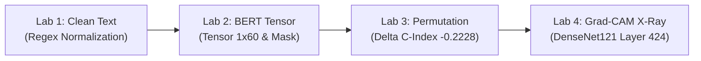

# 👨‍💻 KỊCH BẢN THUYẾT TRÌNH & DEMO CHI TIẾT: LINH
## 🩻 Chủ đề: Medical NLP, BERT Tokenization, Permutation & Grad-CAM Labs
> **Thời lượng chuẩn:** 5 phút (khoảng 1.25 phút / lab)  
> **Nền tảng Demo:** Mở tab **👨‍💻 Linh** trên ứng dụng [`treatment_effect_demo.html`](index.html)

---

---

## 📍 LAB 1: CHUẨN HÓA VĂN BẢN LÂM SÀNG BẰNG REGEX (C3_W2_LAB_1)
* **Thời lượng:** ~1 phút 15 giây
* **Thao tác trên màn hình:**
  1. Bấm vào bước **`Lab 1: Clean Text (C3_W2_Lab_1)`** trên thanh Pipeline.
  2. Chỉ vào ô văn bản thô: `"Patient has fever and/or cough.. Possible pneumonia."`.
  3. Bấm nút **`✨ Clean Medical Text`** → Chỉ vào kết quả sau chuẩn hóa: `"Patient has fever or cough. Possible pneumonia."`.
  4. Chỉ vào 3 luật Regex tự động trong Khối 6.

### 🇬🇧 English Spoken Script:
> *"Hello Professor and everyone, my name is Linh.*
> 
> *While Khương and Hiếu analyzed structured clinical tables, real-world hospital EHRs are full of messy, unstructured doctor notes. In Lab 1, we address text pre-processing.*
> 
> *Raw medical notes are plagued with ambiguities like slashes ('and/or'), double dots ('..'), and inconsistent spacing. If we feed this directly into NLP models, it causes tokenizer fragmentation and out-of-vocabulary errors. Our regex engine applies three deterministic rules:*
> 1. *Replaces ambiguous slash patterns: `and/or` $\to$ `or`.*
> 2. *Collapses consecutive dots `..` into a single period `.`.*
> 3. *Normalizes irregular whitespace.*
> 
> *As demonstrated on screen, dirty notes are instantly standardized into clean sentences ready for deep learning tokenizers."*

### 🇻🇳 Lời Thoại Tiếng Việt:
> *"Kính chào Thầy và các bạn, mình là Linh.*
> 
> *Trong khi bạn Khương và bạn Hiếu phân tích dữ liệu dạng bảng có cấu trúc, hồ sơ bệnh án điện tử thực tế chứa rất nhiều ghi chú tự do không có cấu trúc của bác sĩ. Ở Lab 1, mình phụ trách phần tiền xử lý văn bản.*
> 
> *Bệnh án thô luôn chứa các ký tự mơ hồ như dấu gạch chéo ('and/or'), dấu chấm kép ('..') và khoảng trắng lung tung. Nếu đưa thẳng vào mô hình NLP, bộ tách từ sẽ bị vỡ vụn và sinh lỗi từ ngoài từ điển (OOV). Thuật toán Regex của nhóm áp dụng 3 quy tắc chuẩn hóa:*
> 1. *Thay thế mẫu dấu gạch chéo mơ hồ: `and/or` thành `or`.*
> 2. *Gộp các dấu chấm liên tiếp `..` thành đúng một dấu chấm `.` duy nhất.*
> 3. *Chuẩn hóa các khoảng trắng thừa.*
> 
> *Như Thầy thấy trên màn hình: Văn bản bừa bộn ban đầu lập tức được làm sạch hoàn hảo, sẵn sàng cho các mô hình Deep Learning."*

* **📐 Điểm Toán & Code Cần Nhấn Mạnh:**
  - $s \leftarrow \text{regex\_replace}(s, \text{r"and/or"}, \text{"or"})$
  - $s \leftarrow \text{regex\_replace}(s, \text{r"\.{2,}"}, \text{"."})$

---

## 📍 LAB 2: MÃ HÓA TENSOR ĐẦU VÀO CHO BERT (C3_W2_LAB_3)
* **Thời lượng:** ~1 phút 15 giây
* **Thao tác trên màn hình:**
  1. Bấm vào bước **`Lab 2: BERT Input Tensor (C3_W2_Lab_3)`** trên thanh Pipeline.
  2. Chọn câu mẫu số 1 trong menu thả xuống → Quan sát danh sách Token IDs xuất hiện.
  3. Chỉ vào Token đặc biệt: **`[CLS] (101)`** ở đầu, **`[SEP] (102)`** ở cuối, và các thẻ **`[PAD] (0)`** phía sau.
  4. Chỉ vào Khối 6 giải thích vai trò của Vector Attention Mask.

### 🇬🇧 English Spoken Script:
> *"In Lab 2, Transformer architectures like BERT cannot read raw character strings. We must convert text into fixed-size numerical tensors.*
> 
> *As shown in our live tensor visualizer:*
> 1. *We apply **WordPiece Tokenization**, mapping clinical words to vocabulary IDs (e.g., 'pneumonia' becomes ID `18271`).*
> 2. *We prepend the special classification token **`[CLS]=101`** at index 0, and append the sentence separator token **`[SEP]=102`** at the end.*
> 3. *Because neural networks require uniform batch shapes, we pad with zeros up to a fixed sequence length of **60**.*
> 
> *Crucially, we generate a binary **Attention Mask** vector: $M_i = 1$ for real words and $0$ for padding. This ensures BERT's multi-head Self-Attention mechanism does not waste computation on meaningless zero slots!"*

### 🇻🇳 Lời Thoại Tiếng Việt:
> *"Ở Lab 2, các kiến trúc Transformer như BERT không thể đọc trực tiếp các ký tự chữ cái. Chúng ta bắt buộc phải chuyển đổi văn bản thành các Tensor số học có kích thước cố định.*
> 
> *Như biểu diễn trực quan trên màn hình:*
> 1. *Nhóm dùng thuật toán **WordPiece Tokenization** ánh xạ từng từ y khoa sang mã ID trong từ điển (ví dụ từ 'pneumonia' là ID `18271`).*
> 2. *Gắn token đặc biệt **`[CLS]=101`** ở đầu câu (để nắm bắt ngữ cảnh toàn câu) và **`[SEP]=102`** ở cuối câu để ngắt câu.*
> 3. *Vì mạng nơ-ron bắt buộc kích thước đầu vào theo lô phải đồng nhất, ta đệm thêm các số 0 (`[PAD]=0`) cho đủ độ dài cố định là **60**.*
> 
> *Đặc biệt quan trọng, nhóm tạo ra một vector **Attention Mask**: Bằng $1$ với từ thật và bằng $0$ với phần đệm. Điều này giúp cơ chế Self-Attention của BERT tập trung hoàn toàn vào từ ngữ chuyên môn mà không bị phân tâm bởi các số 0 vô nghĩa."*

* **📐 Điểm Toán & Tensor Cần Nhấn Mạnh:**
  - Kích thước Tensor đầu vào: $T \in \mathbb{Z}^{1 \times 60}$.
  - Vector Attention Mask: $M_i = \mathbb{I}(T_i \neq 0)$.
  - Tensor đầu ra sau lớp Embedding: $(1, 60, 768)$.

---

## 📍 LAB 3: ĐỘ QUAN TRỌNG ĐẶC TRƯNG BẰNG HOÁN VỊ (C3_W3_LAB_1)
* **Thời lượng:** ~1 phút 15 giây
* **Thao tác trên màn hình:**
  1. Bấm vào bước **`Lab 3: Permutation Method (C3_W3_Lab_1)`** trên thanh Pipeline.
  2. Bấm nút **`🔀 Shuffle 'Age' Feature`** → Quan sát bảng kết quả chuyển sang màu đỏ rực.
  3. Chỉ vào chỉ số sụt giảm: C-index từ **0.7759** rơi thẳng xuống **0.5531** ($\Delta = \mathbf{-0.2228}$).
  4. Bấm thử nút **`🔀 Shuffle 'Blood Pressure'`** để so sánh mức độ ảnh hưởng.

### 🇬🇧 English Spoken Script:
> *"Moving to model interpretation in Lab 3: Once a prognostic model is trained, how do we prove which clinical features actually drive survival predictions?*
> 
> *We implement **Permutation Feature Importance** (Fisher et al., 2019). This method is model-agnostic and does not require retraining!*
> 
> *Watch what happens when I click 'Shuffle Age': We randomly permute the Age column in our validation cohort, destroying its relationship with patient outcomes while preserving the marginal distribution. The model's Concordance Index (C-index) crashes from a baseline of **0.7759** down to **0.5531**—a dramatic drop of **-0.2228**!*
> 
> *In comparison, shuffling Blood Pressure only causes a minor drop of -0.0701. This rigorously proves to the clinical team that patient Age is the dominant prognostic risk factor in this population."*

### 🇻🇳 Lời Thoại Tiếng Việt:
> *"Chuyển sang phần giải thích mô hình ở Lab 3: Sau khi huấn luyện một mô hình tiên lượng sống còn, làm sao chứng minh đặc trưng lâm sàng nào thực sự chi phối kết quả?*
> 
> *Nhóm triển khai phương pháp **Độ quan trọng Đặc trưng bằng Hoán vị (Permutation Feature Importance)**. Phương pháp này độc lập với cấu trúc mô hình (model-agnostic) và không cần phải huấn luyện lại từ đầu!*
> 
> *Thầy và các bạn hãy nhìn khi mình bấm 'Xáo trộn Tuổi': Thuật toán xáo trộn ngẫu nhiên cột Tuổi trên tập kiểm định, phá vỡ hoàn toàn mối liên hệ giữa Tuổi và kết cục bệnh nhân. Ngay lập tức, chỉ số C-index của mô hình sụp đổ từ **0.7759** xuống **0.5531** — mất đứt **-0.2228** điểm!*
> 
> *Trong khi đó, xáo trộn Huyết áp chỉ làm giảm -0.0701. Thí nghiệm này chứng minh rõ ràng với hội đồng y khoa rằng Tuổi là yếu tố tiên lượng rủi ro quan trọng số 1."*

* **📐 Điểm Toán & ML Cần Nhấn Mạnh:**
  - $\text{Importance}(X_j) = C_{\text{baseline}} - C_{\text{shuffled}}(X_j) = 0.7759 - 0.5531 = \mathbf{0.2228}$.
  - Ưu điểm vượt trội so với Drop-Column: Không cần retrain $N$ mô hình tốn kém tài nguyên.

---

## 📍 LAB 4: ĐỊNH VỊ VÙNG BỆNH TRÊN X-QUANG BẰNG GRAD-CAM (C3_W3_LAB_2 & 3)
* **Thời lượng:** ~1 phút 15 giây
* **Thao tác trên màn hình:**
  1. Bấm vào bước **`Lab 4: Grad-CAM X-Ray (C3_W3_Lab_2 & 3)`** trên thanh Pipeline.
  2. Kéo thanh trượt **Grad-CAM Overlay Opacity** lên mức `80%`.
  3. Bấm nút **`Pneumonia`** → Chỉ vào đốm nhiệt đỏ tập trung ở thùy dưới phổi phải.
  4. Bấm nút **`Cardiomegaly`** → Chỉ vào bản đồ nhiệt dịch chuyển sang ôm trọn bóng tim to ở trung thất.
  5. Chuyển giao bài thuyết trình sang Dung.

### 🇬🇧 English Spoken Script:
> *"In Lab 4, we tackle Computer Vision explainability on Chest X-Rays using **Grad-CAM** (Gradient-weighted Class Activation Mapping).*
> 
> *A deep CNN like DenseNet121 has over 7 million parameters. Doctors will never trust a chest diagnosis without seeing where the model looked. We extract feature activations $A^k$ at Layer 424 (`conv5_block16_concat`) with spatial dimensions of $10 \times 10 \times 1024$.*
> 
> *We backpropagate the target class score $y^c$ and compute global average pooled gradient weights $\alpha_k^c$. Applying ReLU keeps only features with positive evidence:*
> - *When predicting **Pneumonia**, the heatmap focuses sharply on the consolidation opacity in the right lower lung lobe.*
> - *When switched to **Cardiomegaly**, the activation shifts entirely to the enlarged cardiac silhouette.*
> 
> *Now, I hand over to **Dung** to present how we mine 100,000 hospital text reports to train these multi-label CNN models!"*

### 🇻🇳 Lời Thoại Tiếng Việt:
> *"Ở Lab 4, chúng ta giải quyết bài toán thị giác máy tính trên ảnh X-quang ngực bằng kỹ thuật **Grad-CAM** (Bản đồ Kích hoạt Lớp theo Trọng số Gradient).*
> 
> *Mạng CNN sâu như DenseNet121 có hơn 7 triệu tham số. Bác sĩ X-quang sẽ không bao giờ tin chẩn đoán nếu không thấy mô hình đang nhìn vào đâu. Nhóm trích xuất các bản đồ đặc trưng $A^k$ tại Layer 424 (`conv5_block16_concat`) với kích thước không gian $10 \times 10 \times 1024$.*
> 
> *Ta lan truyền ngược đạo hàm lớp mục tiêu $y^c$ để tính trọng số $\alpha_k^c$ và lọc qua hàm ReLU:*
> - *Khi chẩn đoán **Viêm phổi (Pneumonia)**, bản đồ nhiệt đỏ rực tập trung chính xác vào vùng đông đặc ở thùy dưới phổi phải.*
> - *Khi chuyển sang **Bóng tim to (Cardiomegaly)**, vùng kích hoạt lập tức dịch chuyển bao trọn lấy cung tim mở rộng ở trung thất.*
> 
> *Sau đây, mình xin chuyển giao bài thuyết trình cho bạn **Dung** để trình bày cách khai phá 100,000 báo cáo bệnh viện tự động nhằm huấn luyện các mạng CNN đa nhãn này!"*

---

## 🎯 CÂU HỎI GIẢNG VIÊN DỰ KIẾN CHO LINH (Q&A PREP)

1. **❓ Câu hỏi:** *"Tại sao Grad-CAM lại lấy activation ở lớp Conv cuối cùng (Layer 424) mà không lấy ở các lớp Conv đầu tiên?"*
   - **💡 Trả lời:** *"Các lớp Conv đầu tiên chỉ bắt các đặc trưng mức thấp như đường viền, cạnh, góc vô nghĩa về mặt bệnh học. Lớp Conv cuối cùng (Layer 424) có trường tiếp nhận (receptive field) bao trọn toàn bộ bức ảnh và lưu giữ các đặc trưng ngữ nghĩa bệnh học cao cấp nhất (như khối thâm nhiễm, bóng tim) trong khi vẫn giữ được thông tin vị trí không gian 2D."*

2. **❓ Câu hỏi:** *"Tại sao phải dùng hàm ReLU trong công thức Grad-CAM $L^c = \text{ReLU}(\sum \alpha_k^c A^k)$?"*
   - **💡 Trả lời:** *"Hàm ReLU lọc bỏ các giá trị âm, tức là chỉ giữ lại những vùng pixel làm TĂNG xác suất chẩn đoán bệnh $c$. Nếu không có ReLU, bản đồ nhiệt sẽ bị nhiễu bởi những vùng đặc trưng thuộc về các bệnh khác hoặc cấu trúc lành tính."*
