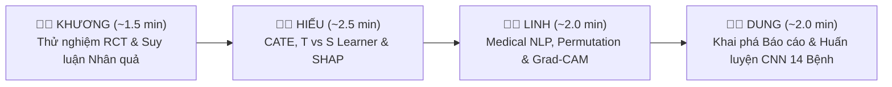

# 🎤 AI For Medical Treatment — Kịch Bản Thuyết Trình & Live Demo Song Ngữ (Bilingual Presentation & Demo Scenarios)

> **Khóa học:** Introduction to Machine Learning (Course 3: AI for Medical Treatment — DeepLearning.AI)  
> **Nền tảng Demo:** [`treatment_effect_demo.html`](index.html)  
> **Thành viên:** Khương · Hiếu · Linh · Dung  
> **Tổng thời lượng:** ~7 – 8 phút (Phù hợp chuẩn báo cáo nhóm)

---

## 🧭 Tổng Quan Phân Chia Kịch Bản (Group Presentation Overview)

---

## 1. 👨‍💼 KHƯƠNG — Clinical Foundations & Causal Inference (~1.5 Phút)

### 🎯 Mục tiêu:
Giải thích câu hỏi y khoa cốt lõi: *"Thuốc này có thực sự cứu mạng bệnh nhân không, và làm sao chứng minh về mặt toán học?"*

---

### 📍 Bước 1: Tại sao phải Thử nghiệm Ngẫu nhiên (Why RCT?)
* **Thao tác Demo:** Bấm chọn `1. Clinical Question (Why RCT?)` &rarr; Bấm chuyển đổi giữa `🎲 Coin Flip (Clean RCT)` và `👨‍⚕️ Doctor Choice (Biased)`.
* **🇬🇧 English Script:**
  > *"Good morning professor and everyone. I am Khương. Today, our group presents AI for Medical Treatment. We begin with a fundamental clinical challenge: How do we know a new drug actually works? In hospitals, doctors naturally prescribe stronger medicines to sicker patients. If we train standard Machine Learning on observational records, the algorithm falsely associates the drug with higher mortality! By conducting a Randomized Controlled Trial (RCT), the random coin toss breaks all backdoor confounding paths. As shown in our live Table 1, baseline covariates like Age and Blood Pressure are perfectly balanced with an SMD below 0.1."*
* **🇻🇳 Lời thoại Tiếng Việt:**
  > *"Kính chào thầy và các bạn, mình là Khương. Nhóm mình xin trình bày về AI trong Điều trị Y khoa. Đầu tiên là bài toán lâm sàng cốt lõi: Làm sao biết một loại thuốc thực sự cứu sống bệnh nhân? Trong bệnh viện, bác sĩ thường kê đơn thuốc mạnh cho bệnh nhân nặng. Nếu dùng ML thông thường trên bệnh án quá khứ, mô hình sẽ tưởng nhầm thuốc gây tử vong! Thử nghiệm ngẫu nhiên có đối chứng (RCT) giải quyết triệt để vấn đề này: việc bốc thăm ngẫu nhiên cắt đứt mọi mối liên hệ gây nhiễu. Như trên Bảng Table 1, độ lệch chuẩn hóa SMD đều dưới 0.1, chứng minh hai nhóm hoàn toàn tương đương."*

---

### 📍 Bước 2: Đo lường Mức Giảm Nguy Cơ (ARR & NNT)
* **Thao tác Demo:** Bấm chọn `2. Population Risk (ARR & NNT)` &rarr; Kéo thanh trượt $N=1,200$, Control Risk $35\%$, RRR $40\%$.
* **🇬🇧 English Script:**
  > *"In Step 2, we quantify treatment power using clinician-friendly metrics. With a 35% baseline event rate and 40% relative risk reduction, the drug achieves an Absolute Risk Reduction (ARR) of +14.0%. Dividing 1 by ARR gives a Number Needed to Treat (NNT) of 7.1. As visualized in our 10-patient grid, this means doctors only need to treat 7 patients to prevent 1 fatal stroke, providing clear economic justification for hospital procurement."*
* **🇻🇳 Lời thoại Tiếng Việt:**
  > *"Ở Bước 2, chúng ta đo lường hiệu quả bằng các chỉ số lâm sàng thực tế: Giảm nguy cơ tuyệt đối (ARR) và Số bệnh nhân cần điều trị (NNT). Với nguy cơ nhóm đối chứng là 35% và mức giảm tương đối 40%, thuốc đạt ARR là +14.0%. Lấy 1 chia cho ARR ta được NNT = 7.1. Nhìn vào lưới 10 bệnh nhân trực quan: Cứ điều trị 7 người là cứu được 1 ca đột quỵ — đây là con số thuyết phục các cơ quan bảo hiểm chi trả."*

---

### 📍 Bước 3: Nghịch Lý Vũ Trụ Song Song (Neyman-Rubin Counterfactuals)
* **Thao tác Demo:** Bấm chọn `3. Counterfactual Dilemma` &rarr; Bấm `Patient #1` rồi bấm `Patient #42 (Grandpa An)`.
* **🇬🇧 English Script:**
  > *"In Step 3, we face the Fundamental Problem of Causal Inference. Under the Neyman-Rubin model, every patient has two potential outcomes: Y(1) if treated and Y(0) if untreated. But in reality, when Patient 42 takes the pill and survives, his untreated counterfactual state in the parallel universe is lost forever! We cannot clone patients."*
* **🇻🇳 Lời thoại Tiếng Việt:**
  > *"Sang Bước 3, chúng ta gặp bài toán nan giải nhất của Suy luận nhân quả (Neyman-Rubin). Mỗi bệnh nhân có 2 kết cục tiềm năng: Y(1) khi uống thuốc và Y(0) khi không uống. Nhưng khi Bệnh nhân số 42 đã uống thuốc và sống sót, kịch bản nếu ông không uống thuốc trong vũ trụ song song sẽ vĩnh viễn biến mất! Ta không thể nhân bản vô tính bệnh nhân."*

---

### 📍 Bước 4: Chuyển giao sang Hiếu (Bridge to CATE)
* **Thao tác Demo:** Bấm chọn `4. Bridge to CATE` &rarr; Bấm `👉 Hand-off to Hiếu`.
* **🇬🇧 English Script:**
  > *"Because population ATE treats all patients identically, it hides vital subgroup differences. Grandpa An gains a huge +26.4% benefit, whereas young Alex gains only +5.2%. To personalize treatment, I now hand over to Hiếu to explain Conditional Average Treatment Effect (CATE) modeling."*
* **🇻🇳 Lời thoại Tiếng Việt:**
  > *"Chỉ số trung bình ATE cào bằng tất cả mọi người, che giấu sự khác biệt giữa các cá thể. Ông An hưởng lợi tới +26.4%, trong khi anh Alex chỉ được +5.2%. Để cá thể hóa điều trị, mình xin nhường lời cho bạn Hiếu trình bày về mô hình CATE."*

---

## 2. 👨‍💻 HIẾU — Treatment Effect Modeling & Evaluation (~2.5 Phút)

### 🎯 Mục tiêu:
Trình bày kiến trúc Machine Learning để ước lượng hiệu quả cá thể hóa (T-Learner vs S-Learner), kiểm thử mô hình bằng Matched Pairs ($0.6342$), và bóc tách giải thích quyết định bằng SHAP.

---

### 📍 Bước 1: Đặc trưng Bệnh nhân & Rủi ro Nền (Baseline Risk)
* **Thao tác Demo:** Bấm tab **Hiếu** &rarr; Bấm `1. Patient Covariates` &rarr; Chọn mẫu `👴 Grandpa An (70yo, SBP 165)`.
* **🇬🇧 English Script:**
  > *"Thank you Khương. I am Hiếu. In Step 1, we map patient covariates X—Age, Systolic Blood Pressure, and BMI—into baseline risk using a logistic link function. For Grandpa An at age 70 with blood pressure 165 mmHg, his untreated baseline stroke risk is 48.2%. Because his initial risk is severe, he has the greatest room for absolute risk reduction."*
* **🇻🇳 Lời thoại Tiếng Việt:**
  > *"Cảm ơn Khương. Mình là Hiếu. Ở Bước 1, chúng ta đưa các đặc trưng X gồm Tuổi, Huyết áp tâm thu và BMI vào hàm liên kết Logistic để tính nguy cơ nền. Với Ông An 70 tuổi, huyết áp 165 mmHg, nguy cơ đột quỵ khi không dùng thuốc lên tới 48.2%. Nguy cơ nền càng cao thì tiềm năng hưởng lợi từ thuốc càng lớn."*

---

### 📍 Bước 2: So sánh Mô hình T-Learner vs S-Learner (Hiện tượng Co Rút)
* **Thao tác Demo:** Bấm `2. T-Learner vs S-Learner` &rarr; Bấm chuyển đổi giữa `🌲🌲 T-Learner` và `🌲 S-Learner (Shrinkage)`.
* **🇬🇧 English Script:**
  > *"In Step 2, how do we estimate individual benefit? We compare two architectures. T-Learner trains two independent models—one for the treated arm and one for control. It captures full feature interactions, predicting a +26.4% benefit. In contrast, S-Learner puts treatment W as a single feature in one shared decision tree. Because blood pressure and age have much larger sample variance, the tree split algorithm ignores W. This causes severe feature shrinkage, falsely underestimating benefit down to +15.2%!"*
* **🇻🇳 Lời thoại Tiếng Việt:**
  > *"Ở Bước 2, làm sao để AI dự đoán mức lợi ích cá nhân? Ta so sánh 2 kiến trúc. T-Learner huấn luyện 2 mô hình độc lập (như 2 bác sĩ riêng cho 2 nhóm), bắt trọn tương tác và dự đoán chính xác mức giảm nguy cơ +26.4%. Ngược lại, S-Learner chỉ dùng 1 cây quyết định chung với biến W là 1 đặc trưng. Cây quyết định thường bỏ qua W vì Tuổi và Huyết áp có phương sai lớn hơn, dẫn đến hiện tượng co rút hệ số (shrinkage) và đánh giá thấp lợi ích chỉ còn +15.2%!"*

---

### 📍 Bước 3: Đánh giá bằng Cặp Tương Đồng (Twin Matching & C-for-benefit)
* **Thao tác Demo:** Bấm `3. Matched Pairs` &rarr; Bấm nút `🎲 Resample Clinical Twin Pairs`.
* **🇬🇧 English Script:**
  > *"In Step 3, since we can never observe ground-truth counterfactuals, how do we evaluate our ML model? We use the Matched Pairs Twin Test. We pair two clinically identical patients—one who received the drug and one on placebo—and compute observed pair difference y_d. We evaluate ranking concordance using the C-for-benefit metric. Our model achieves a validation score of 0.6342, matching the recognized international benchmark for clinical benefit ranking."*
* **🇻🇳 Lời thoại Tiếng Việt:**
  > *"Ở Bước 3, vì không thể thấy kết cục song song của cùng 1 người, làm sao ta chấm điểm AI? Nhóm dùng phương pháp Ghép cặp tương đồng (Matched Pairs Twin Test). Ta ghép 2 bệnh nhân có chỉ số giống hệt nhau (1 người uống thuốc, 1 người uống giả dược) để quan sát hiệu số y_d. Sau đó chấm điểm bằng chỉ số C-for-benefit. Mô hình của nhóm đạt 0.6342 — đây là mức điểm chuẩn y khoa quốc tế rất ấn tượng."*

---

### 📍 Bước 4: Biên lai Giải thích Quyết định SHAP (Local SHAP Waterfall)
* **Thao tác Demo:** Bấm `4. Local SHAP Waterfall` &rarr; Kéo nhẹ thanh trượt huyết áp (SBP).
* **🇬🇧 English Script:**
  > *"Finally in Step 4, doctors demand transparent explainability. Using TreeSHAP and Shapley Efficiency, we provide an itemized decision receipt: Starting from the +14.0% population base benefit, high SBP adds +8.5%, advanced Age adds +3.4%, and BMI adds +0.5%, totaling +26.4% individualized benefit. Next, Linh will show how we handle unstructured medical text and X-ray images."*
* **🇻🇳 Lời thoại Tiếng Việt:**
  > *"Cuối cùng ở Bước 4, bác sĩ không bao giờ tin 'hộp đen' AI. Nhóm cung cấp 'Hóa đơn giải trình quyết định' bằng TreeSHAP: Từ mức lợi ích nền dân số +14.0%, Huyết áp cao đóng góp thêm +8.5%, Tuổi già đóng góp +3.4%, BMI đóng góp +0.5%, giải thích trọn vẹn con số +26.4%. Tiếp theo, xin mời bạn Linh trình bày về xử lý văn bản và ảnh X-quang."*

---

## 3. 👨‍💻 LINH — Medical NLP & ML Interpretation Labs (~2.0 Phút)

### 🎯 Mục tiêu:
Trình bày quy trình làm sạch văn bản y khoa (Lab 1), mã hóa Tensor cho BERT (Lab 2), phương pháp hoán vị đo độ quan trọng (Lab 3), và giải thích vùng bệnh trên X-quang bằng Grad-CAM (Lab 4).

---

### 📍 Lab 1: Chuẩn hóa Chuỗi Y khoa (Text Cleaning)
* **Thao tác Demo:** Bấm tab **Linh** &rarr; Bấm `Lab 1: Clean Text` &rarr; Bấm `✨ Clean Medical Text`.
* **🇬🇧 English Script:**
  > *"Hello everyone, I am Linh. Real clinical notes are extremely noisy with typos, double dots, and ambiguous slashes like 'and/or'. In Lab 1, our regex engine normalizes dirty text, converting 'and/or' to 'or' and collapsing duplicate punctuation to prevent out-of-vocabulary errors."*
* **🇻🇳 Lời thoại Tiếng Việt:**
  > *"Chào thầy và các bạn, mình là Linh. Bệnh án văn bản thực tế rất lộn xộn với lỗi chính tả, dấu chấm kép và dấu gạch chéo 'and/or'. Ở Lab 1, thuật toán Regex của nhóm chuẩn hóa chuỗi, đổi 'and/or' thành 'or' và gộp các dấu câu lặp lại để mô hình ngôn ngữ không bị lỗi từ điển."*

---

### 📍 Lab 2: Mã Hóa Tensor Đầu Vào cho BERT (BERT Input Tensor)
* **Thao tác Demo:** Bấm `Lab 2: BERT Input Tensor` &rarr; Chọn câu lâm sàng trong menu.
* **🇬🇧 English Script:**
  > *"In Lab 2, BERT cannot read raw words directly. We apply WordPiece tokenization, prepend [CLS]=101, append [SEP]=102, and pad zeros to a fixed tensor shape of (1, 60). Crucially, we construct an Attention Mask vector that instructs BERT's Self-Attention layers to ignore all padded slots."*
* **🇻🇳 Lời thoại Tiếng Việt:**
  > *"Ở Lab 2, BERT không thể đọc trực tiếp chữ viết. Nhóm áp dụng WordPiece tokenization, gắn token [CLS]=101 ở đầu, [SEP]=102 ở cuối, và chèn số 0 (padding) để tạo Tensor cố định kích thước (1, 60). Đồng thời, nhóm tạo Vector Attention Mask để cơ chế Self-Attention của BERT bỏ qua các vị trí đệm số 0."*

---

### 📍 Lab 3: Độ Quan Trọng bằng Hoán Vị (Permutation Method)
* **Thao tác Demo:** Bấm `Lab 3: Permutation Method` &rarr; Bấm nút `🔀 Shuffle 'Age' Feature`.
* **🇬🇧 English Script:**
  > *"In Lab 3, how do we identify the model's most critical features? We use the Permutation Method on the test cohort. Shuffling the Age column destroys its relationship with the target, causing the C-index to plummet from 0.7759 to 0.5531—a massive drop of -0.2228. This proves Age is the number one prognostic risk driver."*
* **🇻🇳 Lời thoại Tiếng Việt:**
  > *"Ở Lab 3, làm sao biết đặc trưng nào quan trọng nhất? Nhóm dùng phương pháp Xáo trộn hoán vị (Permutation Method) trên tập kiểm thử. Khi xáo trộn ngẫu nhiên cột Tuổi, mối liên hệ nhân quả bị phá vỡ, làm chỉ số C-index tụt thẳng từ 0.7759 xuống 0.5531 (mất tới -0.2228). Điều này chứng minh Tuổi là yếu tố tiên lượng rủi ro số 1."*

---

### 📍 Lab 4: Định Vị Vùng Bệnh X-Quang Bằng Grad-CAM
* **Thao tác Demo:** Bấm `Lab 4: Grad-CAM X-Ray` &rarr; Kéo thanh Opacity $80\%$ &rarr; Chuyển nút `Pneumonia` vs `Cardiomegaly`.
* **🇬🇧 English Script:**
  > *"In Lab 4, we interpret our DenseNet121 CNN on chest X-rays. Using Grad-CAM backpropagation on Layer 424, we pool activation gradients to generate visual heatmaps. As shown on the chest scan, when pneumonia is predicted, the heatmap precisely highlights consolidation in the right lower lobe. I now pass to Dung to explain big data label mining and CNN training."*
* **🇻🇳 Lời thoại Tiếng Việt:**
  > *"Ở Lab 4, nhóm giải thích mô hình CNN DenseNet121 trên ảnh X-quang ngực. Bằng kỹ thuật lan truyền ngược Grad-CAM tại Layer 424, ta tạo ra bản đồ nhiệt không gian. Khi mô hình chẩn đoán Viêm phổi, vùng đỏ tập trung chính xác vào đám mờ ở thùy dưới phổi phải. Tiếp theo, xin mời bạn Dung trình bày về khai phá nhãn tự động và huấn luyện CNN."*

---

## 4. 👩‍💼 DUNG — Automated Labeling, 14-Disease CNNs & F1 Evaluation (~2.0 Phút)

### 🎯 Mục tiêu:
Giải quyết bài toán thắt nút cổ chai: Khai phá 100,000 báo cáo PACS bằng Ontology + NegBio để tạo nhãn huấn luyện mạng CNN 14 bệnh lồng ngực (DenseNet121) và đánh giá ngưỡng $F_1$-score trên dữ liệu mất cân bằng.

---

### 📍 Bước 1, 2, 3: Quy Trình Khai Phá Nhãn Tự Động (Reports, Ontologies, NegBio)
* **Thao tác Demo:** Bấm tab **Dung** &rarr; Bấm lướt qua Bước 1, Bước 2, Bước 3 &rarr; Chọn mẫu `Sample 1 (Negation)` và `Sample 3 (Synonym)`.
* **🇬🇧 English Script:**
  > *"Thank you Linh. I am Dung. In clinical practice, hospitals possess 100,000 unlabelled chest X-rays. Radiologists cannot annotate them manually, but written text reports already exist. Our pipeline mines these reports: First, we map synonyms like 'airspace consolidation' to Pneumonia using medical ontologies. Second, mentioning a disease is not diagnosing it! Our NegBio parser analyzes syntactic dependency trees to detect negation modifiers like 'no evidence of', flipping the label to 0 to eliminate false positives."*
* **🇻🇳 Lời thoại Tiếng Việt:**
  > *"Cảm ơn Linh. Mình là Dung. Trong thực tế, bệnh viện có hàng trăm nghìn ảnh X-quang chưa được gắn nhãn. Bác sĩ không thể dán nhãn từng tấm, nhưng các bản báo cáo văn bản tóm tắt luôn có sẵn. Quy trình của nhóm tự động khai phá: Đầu tiên, ánh xạ các từ đồng nghĩa như 'đông đặc phế nang' về nhãn Viêm phổi nhờ cây phả hệ Ontology. Thứ hai, việc nhắc tên bệnh không đồng nghĩa với có bệnh! Thư viện NegBio phân tích cú pháp để bắt cụm từ phủ định 'không thấy dấu hiệu', đảo nhãn về 0 để tránh báo động giả."*

---

### 📍 Bước 4: Huấn Luyện Mạng CNN 14 Bệnh (DenseNet121 Multi-Label)
* **Thao tác Demo:** Bấm `4. 14-Disease CNN Training` &rarr; Bấm chuyển giữa `Scan #0599` và `Scan #1204`.
* **🇬🇧 English Script:**
  > *"In Step 4, these extracted binary labels serve as ground truth to train a DenseNet121 CNN multi-label classifier. With 14 independent sigmoid heads, the CNN evaluates all thoracic conditions simultaneously. Notice on Scan #0599: the CNN predicts 88% Pneumonia and 72% Infiltration, while keeping Cardiomegaly low at 14%. We optimize using Weighted Cross-Entropy loss to handle severe class imbalance."*
* **🇻🇳 Lời thoại Tiếng Việt:**
  > *"Ở Bước 4, các nhãn nhị phân vừa trích xuất trở thành dữ liệu Ground Truth để huấn luyện mạng CNN DenseNet121 phân loại đa nhãn. Với 14 đầu ra Sigmoid độc lập, mạng dự đoán đồng thời 14 bệnh lồng ngực. Nhìn vào ca chụp #0599: Mạng dự đoán 88% Viêm phổi, 72% Thâm nhiễm, trong khi Bóng tim to chỉ 14%. Nhóm dùng hàm Weighted Cross-Entropy Loss để cân bằng trọng số cho các bệnh hiếm."*

---

### 📍 Bước 5: Bộ Mô Phỏng Ngưỡng CNN & Điểm $F_1$-Score
* **Thao tác Demo:** Bấm `5. CNN F1 Threshold Simulator` &rarr; Kéo thanh trượt ngưỡng từ $0.10 \to 0.90$.
* **🇬🇧 English Script:**
  > *"In Step 5, on rare diseases with 1% prevalence, a dummy model predicting zero for everyone gets 99% accuracy but kills patients! That is why we evaluate our CNN using the harmonic F1-score. By tuning the probability threshold to 0.50, our model achieves a balanced F1-score of 0.921, optimizing both Precision and Recall."*
* **🇻🇳 Lời thoại Tiếng Việt:**
  > *"Ở Bước 5, với các bệnh hiếm gặp chỉ chiếm 1% dân số, một mô hình lười biếng luôn đoán 0 sẽ đạt độ chính xác 99% nhưng bỏ sót toàn bộ bệnh nhân nguy kịch! Đó là lý do ta bắt buộc phải dùng điểm F1. Bằng cách điều chỉnh ngưỡng xác suất về mức tối ưu 0.50, mô hình đạt F1-score là 0.921, cân bằng hoàn hảo giữa độ chuẩn xác (Precision) và độ nhạy (Recall)."*

---

### 📍 Bước 6: Đánh Giá Chiến Lược 2026 & Kết Luận Nhóm
* **Thao tác Demo:** Bấm `6. 2026 Strategic Review` &rarr; Bấm chuyển sang `Biomed Foundation VLM (2026)`.
* **🇬🇧 English Script:**
  > *"Finally in Step 6, our 2026 strategic review: While Course 3 provides the essential causal foundation, rule-based NLP and standard CNNs are evolving. Today in 2026, multi-stage pipelines are superseded by Vision-Language Foundation Models like BiomedCLIP and LLaVA-Med for zero-shot reasoning. This completes our group presentation. Thank you professor and classmates for your attention. We welcome your questions!"*
* **🇻🇳 Lời thoại Tiếng Việt:**
  > *"Cuối cùng ở Bước 6 là phần nhìn nhận chiến lược năm 2026: Dù Course 3 trang bị tư duy nhân quả nền tảng rất vững chắc, công nghệ đang tiến rất nhanh. Đến năm 2026, các quy tắc Regex thủ công đang dần được thay thế bởi Mô hình Nền tảng Thị giác-Ngôn ngữ (như BiomedCLIP hay LLaVA-Med) với khả năng suy luận Zero-shot trực tiếp từ ảnh và văn bản. Nhóm mình xin kết thúc phần trình bày tại đây. Cảm ơn thầy và các bạn đã lắng nghe!"*
