# 🏥 AI For Medical Treatment — Interactive Group Presentation Platform

> **Course:** Introduction to Machine Learning / AI for Medicine (Course 3: AI for Medical Treatment - DeepLearning.AI)  
> **Team Members:** Khương, Hiếu, Linh, Dung

---

## 🌐 Live Presentation & Interactive Demo
This repository contains a standalone, web-based interactive presentation platform designed for our group's final project presentation.

- **Main Presentation App:** [`index.html`](index.html) or [`treatment_effect_demo.html`](treatment_effect_demo.html)
- **GitHub Pages Ready:** Can be hosted directly on GitHub Pages for live browser presentations.

---

## 👥 Group Structure & Workflow Pipelines

```mermaid
flowchart LR
    subgraph K ["👨‍💼 Khương · Clinical Foundations"]
        K1[Why RCT? / Confounder Elimination] --> K2[Population Risk: ARR & NNT]
        K2 --> K3[Neyman-Rubin Counterfactual Dilemma]
        K3 --> K4[Bridge to CATE]
    end

    subgraph H ["👨‍💻 Hiếu · Treatment Effect Modeling"]
        H1[Covariates & Baseline Risk] --> H2[T-Learner vs S-Learner Shrinkage]
        H2 --> H3[Matched Pairs Twin Test & C-for-benefit 0.6342]
        H3 --> H4[Local SHAP Waterfall Receipts]
    end

    subgraph L ["👨‍💻 Linh · Medical NLP & Interpretation"]
        L1[Lab 1: Regex Text Normalization] --> L2[Lab 2: BERT Input Tensor 1x60]
        L2 --> L3[Lab 3: Permutation Importance Delta -0.2228]
        L3 --> L4[Lab 4: Grad-CAM DenseNet121 Layer 424 Heatmaps]
    end

    subgraph D ["👩‍💼 Dung · Automated Labeling & CNNs"]
        D1[100k PACS Unstructured Reports] --> D2[Synonyms & Is-A Ontologies]
        D2 --> D3[NegBio Negation Parsing]
        D3 --> D4[14-Disease Multi-Label CNN Model]
        D4 --> D5[F1-Score 0.921 Threshold Simulator]
        D5 --> D6[2026 Strategic Foundation Model Review]
    end

    K4 --> H1
    H4 --> L1
    L4 --> D1
```



---

## 🛠️ Key Technical Features
1. **100% Dynamic Per-Step Cards:** Every step across all 4 presenters dynamically updates:
   - Scenario description
   - Touch-to-demo input controls (Sliders, Coin-flip allocator, Scan selectors, Threshold tuners)
   - Algorithm logic
   - Exact mathematical formulas with live numbers
   - Output tables / stat boxes
   - Specialized model architecture & visualizer diagrams (DAGs, C-index meters, Attention matrices, Grad-CAM overlays, CNN Sigmoid bar charts).
2. **Zero Dependencies:** Pure HTML, Vanilla CSS, and modern JavaScript. Requires no server setup or external installations.

---

## 🚀 How to Run Locally
Simply open `index.html` in any modern web browser:
```bash
open index.html
```
Or serve via Python local server:
```bash
python3 -m http.server 8000
# Then visit http://localhost:8000
```
